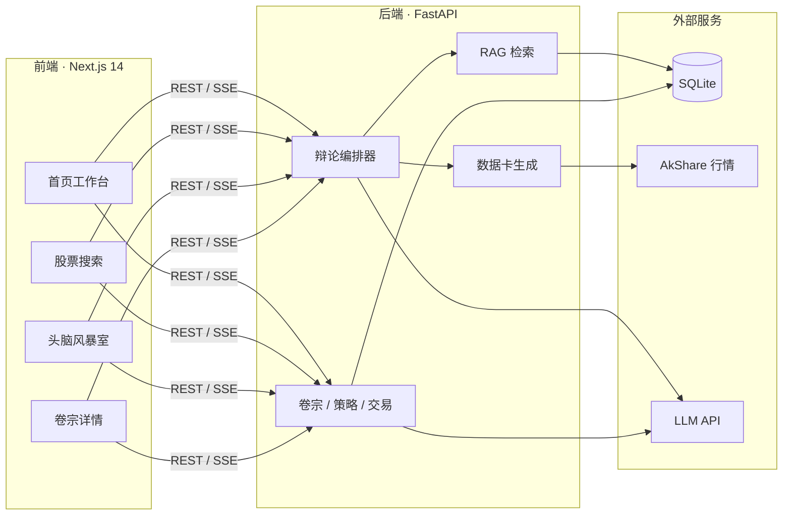

<div align="center">

# 镜衡 · JingHeng

**照见盲点，衡定策略**

一款帮助投资者形成可执行策略、持续复盘改进的 AI 投研思辨工作台

[](https://www.python.org/)
[](https://fastapi.tiangolo.com/)
[](https://nextjs.org/)
[](https://react.dev/)
[](https://www.deepseek.com/)
[](https://akshare.akfamily.xyz/)

[功能亮点](#-功能亮点) · [快速开始](#-快速开始) · [架构](#-系统架构) · [配置](#%EF%B8%8F-配置说明) · [API](#-api-概览)

</div>

---

## 镜衡是什么？

镜衡**不是**荐股工具，也**不是**量化交易平台。它聚焦投资研究中最容易被忽略的两件事：

| 痛点 | 镜衡的做法 |
|------|-----------|
| 只看到支持自己观点的信息，逻辑有盲区 | **AI 多空辩论** — 强制呈现正反两面论据 |
| 分析很多，却落不成可执行策略 | **策略教练** — 将辩论结论转化为量化策略卡片 |
| 赚了亏了，却说不清当初为什么买 | **卷宗系统** — 追溯策略演变，归因每笔交易 |

> **Slogan 释义**
>
> - **照见盲点** — AI 辩论像一面镜子，照出投资逻辑中的盲区与偏误
> - **衡定策略** — 用数据与权衡，帮你定下可执行的量化策略

---

## ✨ 功能亮点

<table>
<tr>
<td width="50%" valign="top">

### 🗣️ AI 多空辩论

- 多头 / 空头 Agent 多轮交锋，SSE 实时流式输出
- 自动生成**数据卡**，注入行情、财务与行业对标
- RAG 知识增强：金融概念、公告、研报片段检索
- 裁判裁决 + 事实校验，标注待核实信息

</td>
<td width="50%" valign="top">

### 🎯 策略教练

- 基于辩论结论，引导填写可量化策略维度
- 入场条件、止损线、目标价、仓位规则
- 流式对话，逐步收敛为结构化策略卡片

</td>
</tr>
<tr>
<td width="50%" valign="top">

### 📁 卷宗系统

- 按股票建立投资档案，沉淀研究笔记
- 策略版本管理：查看历史、编辑迭代
- 交易记录录入（买入 / 卖出，不可篡改）
- 持仓推算、收益曲线、决策质量分析

</td>
<td width="50%" valign="top">

### 📊 投研工作台

- 市场脉搏、组合概览、待复盘提醒
- 数据导出（JSON / CSV）
- 支持 DeepSeek、OpenAI、通义千问、智谱等多 LLM 提供商
- 深色专业 UI，面向长期跟踪场景设计

</td>
</tr>
</table>

---

## 🔄 系统架构



**核心闭环：** 搜索标的 → 多空辩论 → 策略教练 → 写入卷宗 → 记录交易 → 复盘归因

---

## 🚀 快速开始

### 环境要求

| 依赖 | 版本 |
|------|------|
| Python | 3.12+ |
| Node.js | 18+ |
| 包管理 | [pnpm](https://pnpm.io/)（推荐） |
| LLM | DeepSeek API Key（或其他兼容 OpenAI 格式的提供商） |

### 1. 克隆仓库

```bash
git clone <your-repo-url>
cd projects
```

### 2. 安装依赖

```bash
# Python 依赖（含 FastAPI、AkShare、RAG 向量检索等）
pip install -r requirements.txt

# 前端依赖
cd frontend && pnpm install && cd ..
```

### 3. 配置环境变量

在项目根目录创建 `.env` 文件：

```env
DEEPSEEK_API_KEY=your_api_key_here
```

> 也可在应用首页直接配置 LLM（API Key / Base URL / Model），配置保存在浏览器本地，无需重启服务。

### 4. 启动服务

**方式 A — 分别启动（开发推荐）**

```bash
# 终端 1：后端（端口 8000）
python run_backend.py

# 终端 2：前端（端口 5000）
cd frontend && pnpm dev -- -p 5000
```

**方式 B — 一键启动**

```bash
cd frontend && pnpm run dev:all
```

> `dev:all` 默认将前端跑在 **3000** 端口。若需与文档一致使用 5000，请用方式 A。

### 5. 访问应用

| 服务 | 地址 |
|------|------|
| 前端 | [http://localhost:5000](http://localhost:5000) |
| 后端 API | [http://localhost:8000](http://localhost:8000) |
| 健康检查 | [http://localhost:8000/api/health](http://localhost:8000/api/health) |

---

## ⚙️ 配置说明

主配置文件为 [`config.yaml`](config.yaml)，常用项如下：

```yaml
llm:
  model: deepseek-v4-flash          # 辩论、教练主力模型
  reasoning_model: deepseek-v4-pro  # 裁判、事实校验推理模型

debate:
  max_rounds: 3                     # 辩论轮次

database:
  path: data/jingheng.db

rag:
  embedding_model: BAAI/bge-m3      # 向量检索模型
```

<details>
<summary><b>后端热重载（可选）</b></summary>

Windows 环境下 `uvicorn --reload` 可能遗留旧进程。默认使用单进程启动；如需热重载：

```bash
set JINGHENG_BACKEND_RELOAD=1   # Windows
export JINGHENG_BACKEND_RELOAD=1  # macOS / Linux
python run_backend.py
```

</details>

---

## 📂 项目结构

```
projects/
├── backend/                 # FastAPI 后端
│   ├── app.py               # 应用入口、路由注册
│   ├── schemas.py           # Pydantic 数据模型
│   ├── helpers.py           # 共享工具函数
│   └── routers/             # API 路由（按职责拆分）
│       ├── stock.py         # 股票搜索、健康检查
│       ├── dossier.py       # 卷宗 CRUD、数据导出
│       ├── strategy.py      # 策略版本管理
│       ├── transaction.py   # 交易记录
│       └── debate.py        # 辩论 SSE、教练、金融科普
├── frontend/                # Next.js 14 前端
│   ├── app/                 # 页面与 API 代理
│   │   ├── page.tsx         # 首页 / 工作台
│   │   ├── search/          # 股票搜索
│   │   ├── brainstorm/      # 头脑风暴室（辩论 + 教练）
│   │   └── dossier/         # 卷宗列表与详情
│   ├── components/          # UI 组件（shadcn/ui）
│   └── lib/                 # API 封装、LLM 配置
├── modules/debate/          # 辩论核心逻辑
│   ├── orchestrator.py      # 辩论编排器
│   ├── agents.py            # 多头 / 空头 Prompt
│   ├── data_card.py         # 数据卡生成
│   └── fact_check.py        # 事实校验
├── services/                # 数据与基础服务
│   ├── akshare_client.py    # A 股数据接口
│   ├── llm_client.py        # LLM 调用封装
│   ├── market_data.py       # 行情数据
│   └── rag/                 # RAG 知识增强系统
├── data/                    # SQLite 数据库
├── config.yaml              # 全局配置
└── run_backend.py           # 后端启动脚本
```

---

## 🛠️ 技术栈

| 层级 | 技术 |
|------|------|
| **前端** | Next.js 14 · React 18 · TailwindCSS · shadcn/ui |
| **后端** | Python 3.12 · FastAPI · Uvicorn |
| **AI** | DeepSeek（兼容 OpenAI SDK）· 多 Agent 辩论编排 |
| **知识库** | RAG · BGE-M3 向量检索 · SQLite 向量存储 |
| **数据源** | AkShare（A 股市场数据） |
| **数据库** | SQLite |

---

## 📡 API 概览

| 端点 | 方法 | 说明 |
|------|------|------|
| `/api/health` | GET | 健康检查 |
| `/api/stock/search` | GET | 股票搜索 |
| `/api/dossier/list` | GET | 卷宗列表 |
| `/api/dossier/create` | POST | 创建卷宗 |
| `/api/dossier/{id}/detail` | GET | 卷宗完整详情 |
| `/api/strategy/{id}` | PUT | 更新策略版本 |
| `/api/transaction/create` | POST | 创建交易记录 |
| `/api/debate/stream` | GET | SSE 流式辩论 |
| `/api/debate/coach` | POST | 策略教练对话 |
| `/api/export/dossier/{id}` | GET | 导出卷宗（JSON / CSV） |

完整接口文档启动后端后访问：[http://localhost:8000/docs](http://localhost:8000/docs)

---

## 🗺️ 开发进度

- [x] **阶段 1** — 基础框架、首页、搜索、卷宗列表
- [x] **阶段 2** — 头脑风暴室、SSE 流式辩论、裁判裁决
- [x] **阶段 3** — 卷宗详情、策略版本、交易记录、持仓推算
- [x] **阶段 4** — 收益曲线、数据导出、工作台概览

---

## ⚠️ 免责声明

镜衡是一款**投资研究辅助工具**，所有 AI 生成内容（辩论论据、策略建议、数据解读）**不构成任何投资建议**。

- 市场有风险，投资需谨慎
- 请独立判断，对自己的投资决策负责
- AI 输出可能存在幻觉或数据滞后，请以官方披露信息为准

---

<div align="center">

**镜衡** — 让投资决策有据可循，而非拍脑袋

Made with care for thoughtful investors

</div>
